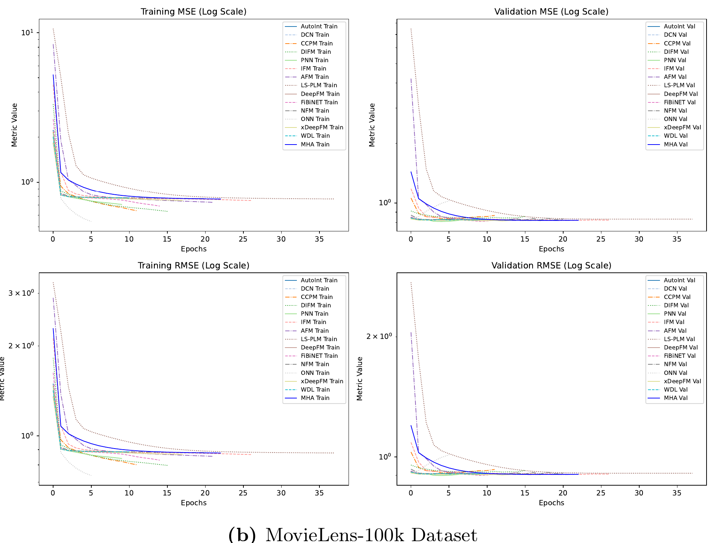

# Integrating Context and Criteria: A Multi-Head Attention-Based Approach for Multi-Criteria Group Recommender Systems

## Overview
This repository contains the implementation of our approach described in the paper:
**"Integrating Context and Criteria: A Multi-Head Attention-Based Approach for Multi-Criteria Group Recommender Systems"**.

Our model leverages **multi-head attention** to integrate multiple criteria and contextual information to enhance group recommendation performance. The architecture is designed to learn user-group interactions efficiently while considering multiple aspects of preference modeling.

## Features
- **Multi-Head Attention Mechanism**: Captures diverse user preferences.
- **Multi-Criteria Learning**: Incorporates multiple decision factors into recommendations.
- **Context-Awareness**: Adapts to dynamic group interactions.

## Comparison of the performance of different models across training and validation sets


## File Structure
```
├── outputs/		          # Outputs from model training
├── ITM-Rec/		          # ITM-Rec Datasets 
├── ml-100k/		          # MovieLens-100k Datasets 
├── requirements.txt	    # Required dependencies
├── Visualization.ipynb 	# Visualization of results
├── itm_run.ipynb       	# Running and Results on ITM-Rec
├── movielens_run.ipynb   # Running and Results on Movielens 
├── README.md		          # Description
```

## Citation
If you use this work, please cite:
```
@article{le2025integrating,
  title={Integrating context and criteria: a multi-head attention-based approach for multi-criteria group recommender systems},
  author={Le, Ngoc Luyen and Abel, Marie-H{\'e}l{\`e}ne},
  journal={World Wide Web},
  volume={28},
  number={4},
  pages={50},
  year={2025},
  publisher={Springer}
}
```

## License
This project is licensed under the MIT License.
